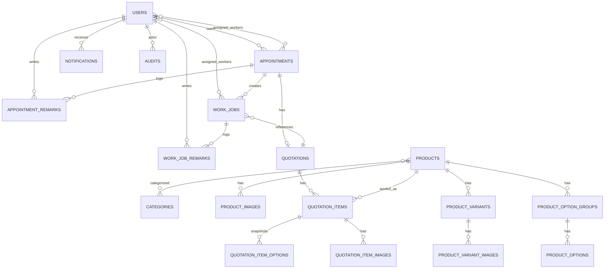
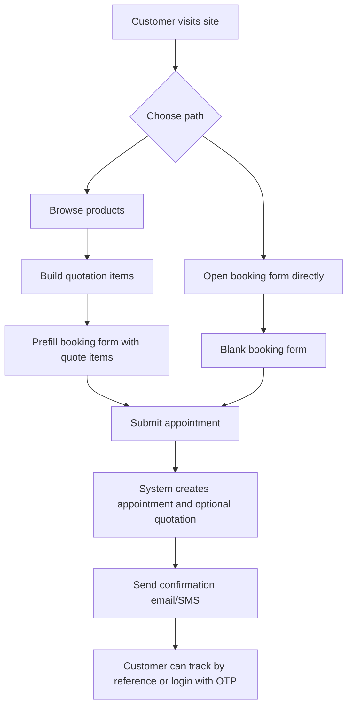
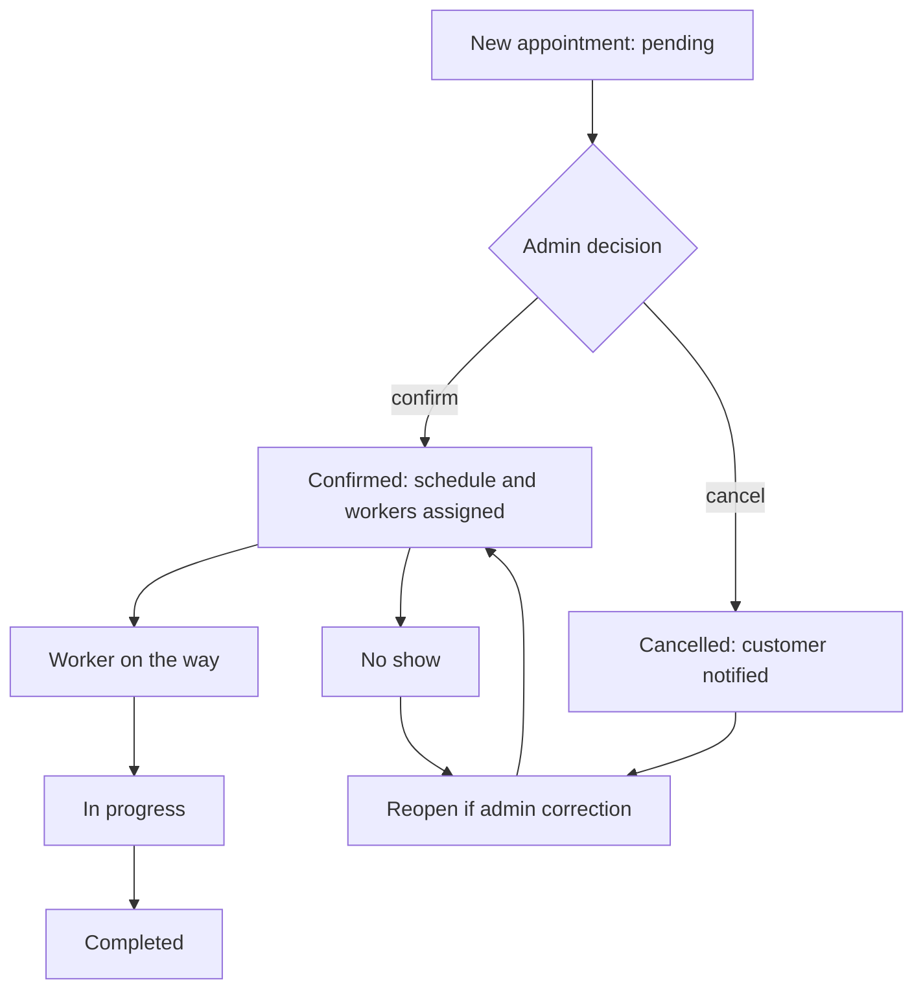
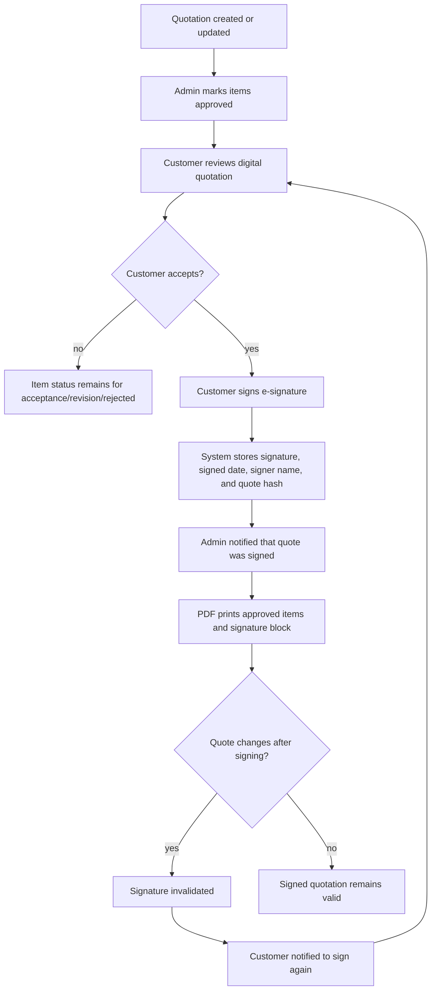
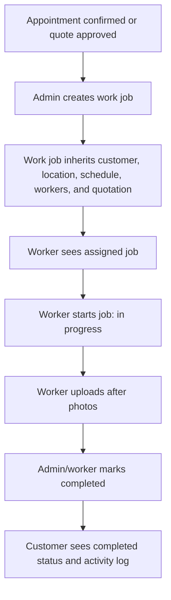
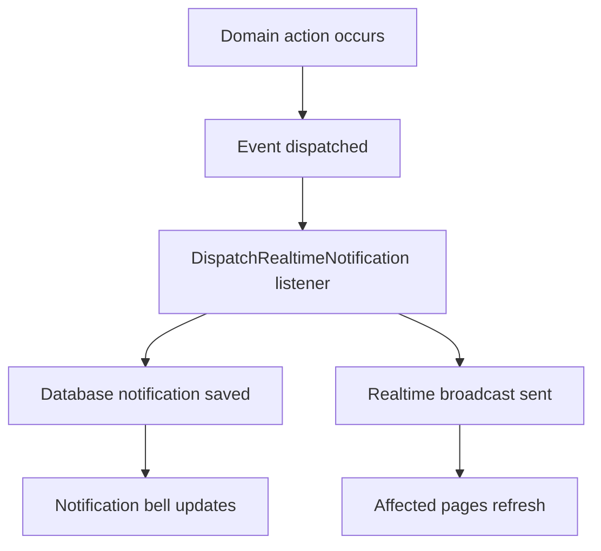
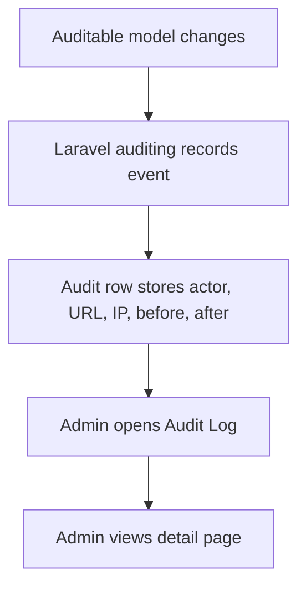

# ERD and Flow Diagrams

## Entity Relationship Diagram

## Customer Booking Flow

## Appointment Operations Flow

## Quotation Signing Flow

## Work Job Flow

## Notification Flow

## Audit Flow

